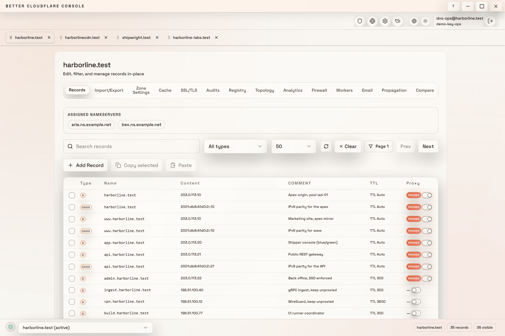
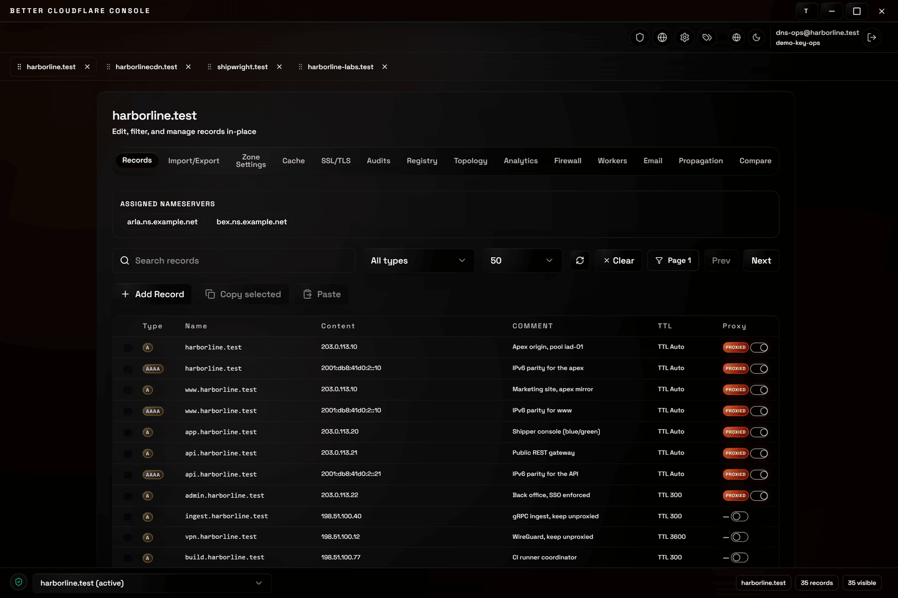
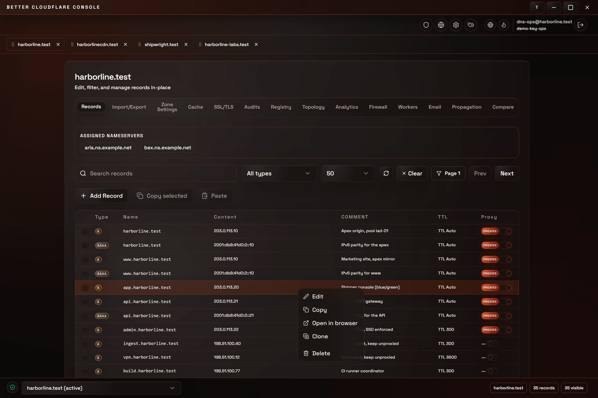
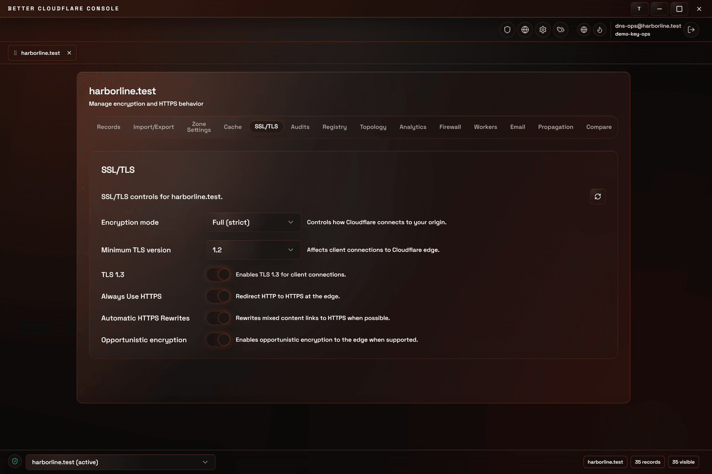
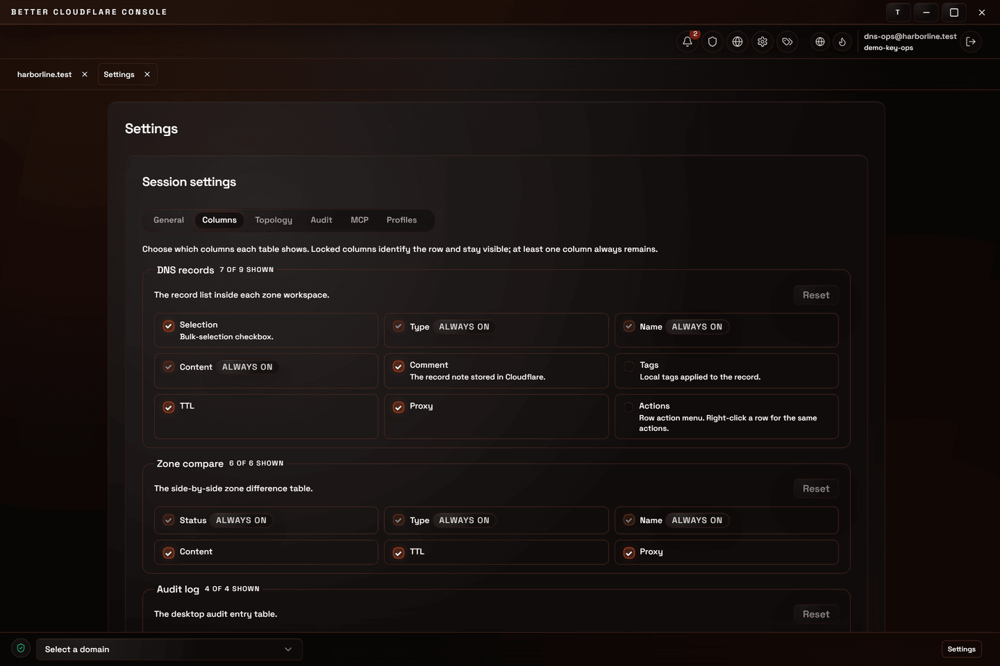
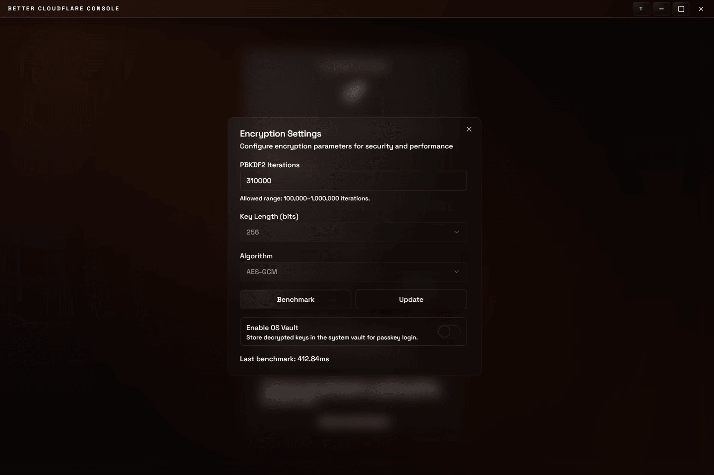
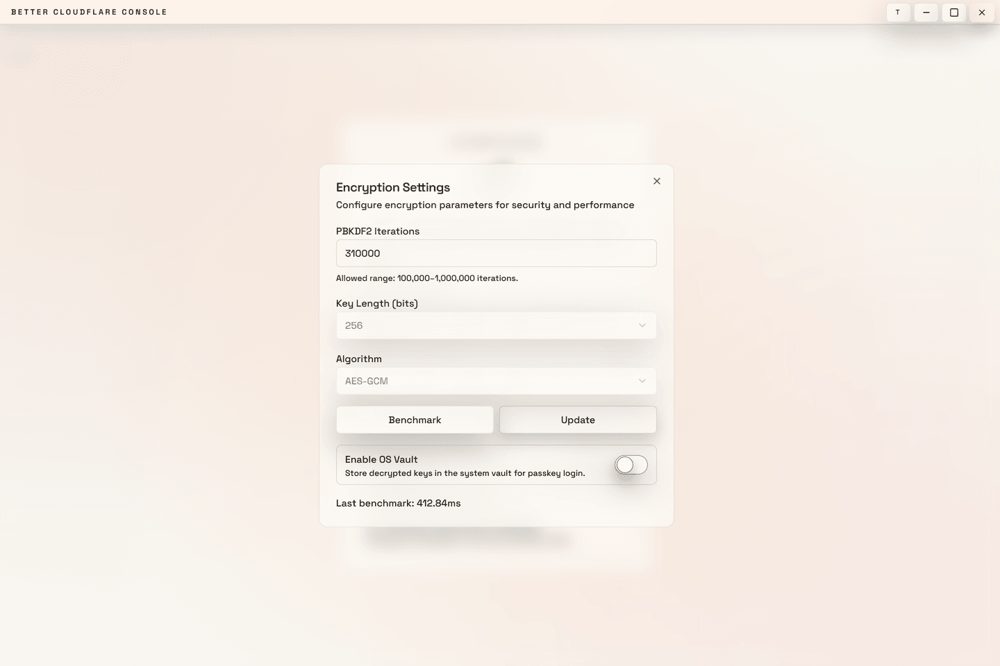

# Better Cloudflare — Design System (Glass Modern Sunset)

## 1) Current System Review (Repo Reality)

- **Stack**: Tailwind + shadcn-style semantic tokens (`--background`, `--foreground`, etc.) defined in `src/index.css` and mapped in `tailwind.config.js`.
- **Theming mechanism**: `document.documentElement.dataset.theme` (set by `src/components/ui/ThemeToggle.tsx`) with theme IDs:
  - `sunset` (default in UI)
  - `oled` (deep black)
  - `light` (tarnished light; warm faded white)
- **Visual direction already present**:
  - Glass surfaces: frequent use of `bg-card/70..90` + `backdrop-blur-*` in `src/components/ui/*`.
  - Sunset glow: gradients and warm highlights in `app/layout.tsx` and utilities in `src/index.css`.
- **Gaps / inconsistencies to clean up over time**:
  - Several **hard-coded RGBA** glows/gradients exist alongside token-based colors (good candidates to token-ize).
  - Theme is token-driven, but some “glass feel” decisions (blur, border alpha, shadow recipes) are embedded per-component instead of being standardized as recipes.

## 2) Design Principles (What “Glass Modern Sunset” Means Here)

1. **Modernism**: clear hierarchy, generous spacing, restrained ornament, high legibility.
2. **Glassmorphism**: translucent surfaces with blur, subtle borders, and controlled specular highlights.
3. **Sunset identity**: warm orange-red accents and glows; never neon by default.
4. **Dark-mode friendly by default**: the primary brand theme is dark (`sunset`) with readable contrast and subdued backgrounds.
5. **Theme parity**: all themes share the same semantic tokens; components should not need theme-specific class overrides.

## 3) Token Model (Single Source of Truth)

All UI styling should be expressed via semantic tokens (HSL triplets) and Tailwind’s mapped colors.

**Core tokens (existing and required)**

- `--background`, `--foreground`
- `--card`, `--card-foreground`
- `--popover`, `--popover-foreground`
- `--primary`, `--primary-foreground`
- `--secondary`, `--secondary-foreground`
- `--muted`, `--muted-foreground`
- `--accent`, `--accent-foreground`
- `--destructive`, `--destructive-foreground`
- `--border`, `--input`, `--ring`
- `--radius`

**Alpha usage convention (how “glass” is applied)**

- Use alpha at the usage site, not in tokens:
  - Surfaces: `bg-card/70..90`, `bg-popover/85..95`
  - Borders: `border-border/50..70`
  - Text: `text-foreground/70..90`, `text-muted-foreground`
  - Overlays: `bg-background/70..85`

## 4) Themes (Palettes + Intent)

Theme IDs are applied as `data-theme` on `<html>`. Nothing else changes: the same component tree, the same class names, the same markup. Everything below is the consequence of swapping the HSL triplets behind the semantic tokens, which is the clearest evidence that principle 5 — theme parity — is actually held.

Here is one screen, the DNS records table, rendered under each of the three shipped themes:

| Sunset (default)                                                                                                                                                     | Light                                                                                                                                                                             |
| -------------------------------------------------------------------------------------------------------------------------------------------------------------------- | --------------------------------------------------------------------------------------------------------------------------------------------------------------------------------- |
|  |  |

Read those three against each other and the rules in this document become concrete. The background moves from warm near-black to warm ivory to pure black, the borders track it, and the **primary stays sunset orange in all three** — the identity colour is not a dark-mode accent that gets swapped out in light mode. Note also what does _not_ change: spacing, radii, type scale and control geometry are theme-independent by construction, because they come from `--radius` and the Tailwind scale rather than from the palette.

### 4.1 Sunset (Default Brand, Dark-Mode First)

Intent: warm, cinematic dark UI; orange primary; comfortable contrast.

- Backgrounds: near-black warm (`--background`), dark cards, warm borders.
- Primary: sunset orange-red.
- Accent/muted: warm brown/ember, never gray-blue.

### 4.2 OLED (Deep Black)

Intent: true-black canvas for OLED power savings and maximum contrast; keep chrome minimal.

- Background & card: pure black.
- Borders/inputs: low but visible contrast (dark gray).
- Primary: sunset orange stays saturated but avoid large bright fills.

### 4.3 Light (Tarnished / Faded White)

Intent: bright but not sterile; warm paper/ivory background; sunset primary remains the identity.

- Background: warm faded ivory.
- Cards/popovers: slightly brighter paper.
- Borders: soft warm-gray (not blue-gray).

## 5) Glass Surface Recipes (Standardize These)

Use these recipes consistently across components (Card, Menus, Dialogs, Panels).

**Framework note**

- The repo currently uses Tailwind + shadcn-style primitives. This doc is intentionally written so you can **keep Tailwind** while building a **fully personalized CSS framework layer** (custom utilities + components) on top.
- If you decide to **remove Tailwind**, do it as a staged migration: introduce stable custom classes first (this repo now has `glass-surface`, `ui-entry`, `ui-tag`, etc.), then replace Tailwind usage incrementally.

**Surface levels**

- `surface-1` (resting panels): `bg-card/80 backdrop-blur-md border border-border/60 shadow-[...]`
- `surface-2` (menus/popovers): `bg-popover/90..95 backdrop-blur-xl border border-border/60 shadow-[...]`
- `surface-3` (modal content): `bg-popover/90 backdrop-blur-xl border border-border/60 shadow-[0_18px_40px_rgba(0,0,0,0.2)]`

The three levels are a depth ladder, and they are meant to be legible as one. `surface-1` is the resting state of a panel that is part of the page; `surface-2` floats briefly over it; `surface-3` takes the page over entirely and is paired with a dimming overlay.

A `surface-2` menu, floating over the records table — note that the table remains readable through and around it, which is the point of using a translucent popover rather than an opaque one:

A `surface-3` dialog, with the `bg-background/80 backdrop-blur-sm` overlay behind it. The stronger blur and the heavier shadow are what separate "modal" from "menu" without needing a different border or background colour:

Both shots also show the alpha-at-the-usage-site convention from §3 in practice: the menu and the dialog use the same `--popover` token, and differ only in the alpha and blur applied where they are used.

**Personalized utilities (implemented)**

- `glass-surface`: consistent glass background + blur + highlight + border
- `glass-surface-hover`: hover lift + border glow
- `glass-fade`: masked fade at the top edge (softens large containers)
- `ui-entry`: menu/list entry hover/active treatment (Radix `data-highlighted` aware)
- `ui-tag`: pill/tag styling with optional `data-variant="primary"`
- `ui-icon-button`: glassy icon button styling

**Borders**

- Default: `border-border/60`
- Focus/active: `ring-2 ring-ring ring-offset-2 ring-offset-background`

**Highlights**

- Use subtle inner highlights: `shadow` + `inset` lines rather than bright gradients on every surface.

## 6) Typography

**Font**

- Primary: Space Grotesk (500–600) as set in `src/index.css`.
- Fallbacks: `"Segoe UI", sans-serif`.

**Scale (Tailwind defaults recommended)**

- Body: `text-sm` and `text-base`
- Headings: `text-lg`, `text-xl`, `text-2xl`

**Letter spacing**

- Use tracking sparingly; reserve wide tracking for chrome (e.g., titlebar) and small caps-like labels.

## 7) Layout, Spacing, Radius

**Spacing**

- Use Tailwind spacing scale; favor `p-6` for panel interiors, `gap-4` for primary stacks, `gap-2` for controls.

**Radius**

- Global radius: `--radius` (currently `0.5rem`); use:
  - Cards/Dialogs: `rounded-xl`
  - Inputs/Buttons: `rounded-md`
  - Pills/toggles: `rounded-full`

## 8) Color Usage Rules (Semantic > Literal)

- **Never** hard-code hex/RGB in components for UI color decisions.
- Gradients/glows are allowed, but should be expressed as **theme-aware tokens** or utilities where possible.
- Use `primary` for calls to action, not for decoration.
- Use `accent` for hover/selected backgrounds; keep contrast safe across themes.

## 9) Components (Behavior + Visual Spec)

### Button

- Default: primary fill, subtle border, elevated shadow; hover increases brightness + shadow.
- Secondary: glass card surface (`bg-card/70`), border, inner shadow.
- Ghost: hover-only background using `accent`.
- Focus: always show ring with `--ring`.

### Card

- Always use `surface-1` recipe.
- Avoid placing high-saturation gradients inside card backgrounds; keep imagery as overlays behind glass.

### Input

- Use `bg-background` + `border-input`.
- Placeholder: `text-muted-foreground`.
- Focus: ring with `--ring`.

### Dropdown / Select / Popover

- Use `surface-2` recipe.
- Item hover/focus uses `accent/70` (not `primary`).

### Dialog

- Overlay: `bg-background/80 backdrop-blur-sm`.
- Content: `surface-3` recipe.

### Switch

- Track: `border-border` and a muted fill.
- Thumb: clear contrast; keep it neutral and let “on” state be expressed via `primary`.

The SSL/TLS panel is the densest concentration of switches in the app and a good place to check the rule is holding — every "on" state reads as `primary`, and an off switch is muted rather than a different hue:

### Tag / pill (`ui-tag`)

- Small, `rounded-full`, muted by default; `data-variant="primary"` for the emphasised case.
- Use tags for state that qualifies a row, never as a substitute for a label.

The column picker uses them to mark columns that cannot be turned off, which is the intended shape: a short piece of state attached to an existing control rather than a second control.

Notice that the locked checkboxes are _disabled and labelled_, not hidden. Removing a control the user expects is a worse outcome than showing it in a state that explains itself.

### Toast

- Surface: `surface-2` with reduced shadow.
- Severity: destructive uses `--destructive`, others keep neutral with optional icon color.

## 10) Accessibility & Motion

- Ensure text contrast remains readable on translucent surfaces; prefer increasing surface opacity before increasing text brightness.
- Respect reduced-motion: animations should remain short and non-essential.
- Focus states must be visible on all themes; use ring tokens consistently.

The first rule is the one most easily broken by a glass surface, because translucency that looks elegant on a dark background can wash a light one out. The same dialog in both themes is the cheapest check available:

| Sunset (default)                                                                                                                                                                                                | Light                                                                                                                                                                                                            |
| --------------------------------------------------------------------------------------------------------------------------------------------------------------------------------------------------------------- | ---------------------------------------------------------------------------------------------------------------------------------------------------------------------------------------------------------------- |
|  |  |

Both are the same markup. The disabled controls have to stay distinguishable from enabled ones _and_ stay readable in both, which is why disabled state is expressed through `muted-foreground` rather than through a global opacity drop — an opacity drop compounds with the surface alpha and fails in the light theme first.

## 11) Implementation References

- Tokens: `src/index.css`
- Tailwind mapping: `tailwind.config.js`
- Theme switching: `src/components/ui/ThemeToggle.tsx`
- Glass overlays: `app/layout.tsx`

## See also

- [Screens and features](screens.md#themes) — the theme switcher in context, and the full screen gallery
- [Development](development.md#the-documentation-screenshot-harness) — how the theme comparisons on this page are captured
