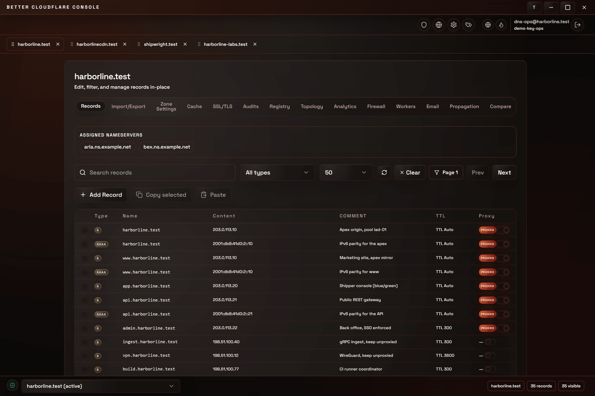
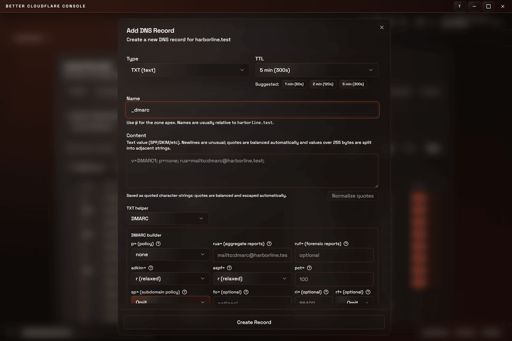
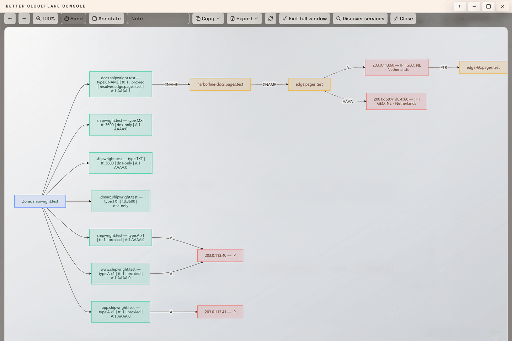
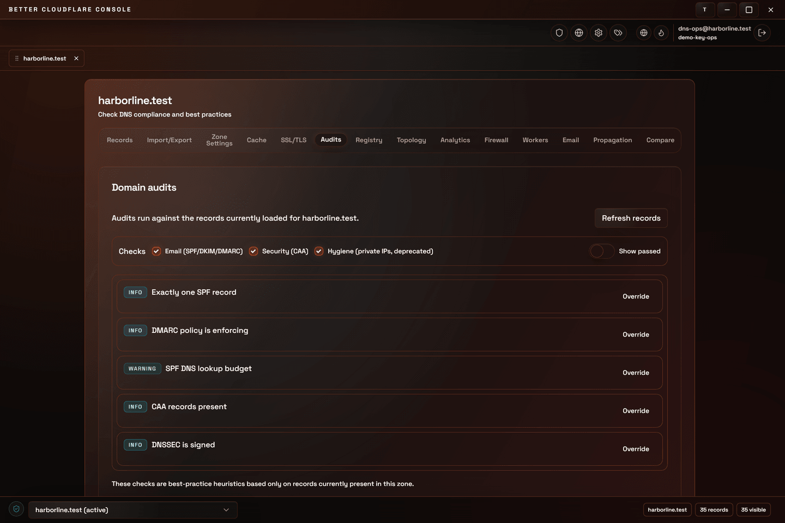
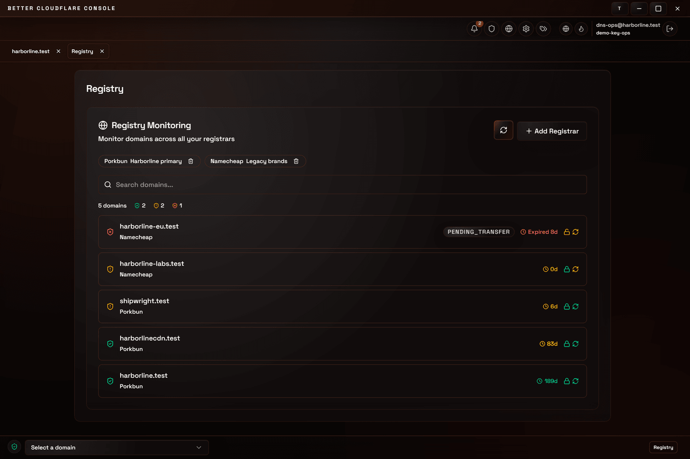
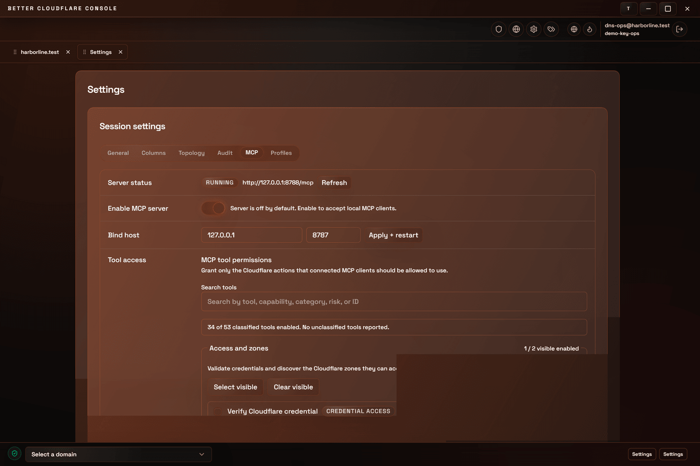

# Better Cloudflare

[](https://github.com/supermarsx/better-cloudflare/actions/workflows/ci.yml)
[](https://github.com/supermarsx/better-cloudflare/releases)
[](license.md)
[](docs/index.md)

[](https://tauri.app/)
[](https://www.rust-lang.org/)
[](https://nextjs.org/)
[](https://react.dev/)

Better Cloudflare is a desktop console for managing DNS across many Cloudflare zones. It is a Tauri v2 application: a React 19 / Next.js frontend over a Rust workspace of 17 crates. It runs on your machine, keeps credentials in the OS keyring, and talks to the Cloudflare API directly.

The work it is built for is bulk and detail editing: changing many records across many zones, composing the fiddly record types (SPF, DMARC, TLSA, SVCB, CAA) from validated fields, moving records between zones without rewriting hostnames by hand, and keeping quoted TXT content inside the limits RFC 1035 sets.



Every zone opens as its own workspace tab. Inside a tab, fourteen views cover records, import/export, zone settings, cache, SSL/TLS, audits, registry, topology, analytics, firewall, workers, email routing, propagation, and zone comparison.

## Contents

- [What it does](#what-it-does)
- [Getting started](#getting-started)
- [Security](#security)
- [Development](#development)
- [Repository map](#repository-map)
- [Documentation](#documentation)
- [Contributing](#contributing)
- [License](#license)

## What it does

### Record builders

24 builders in `src/components/dns/builders/` cover 25 record types: SPF, DKIM, DMARC, CAA, TLSA, SSHFP, DS, DNSKEY, SVCB, HTTPS, NAPTR, LOC, APL, SOA, SRV, URI, RP, HINFO, AFSDB, ANAME, DNAME, CERT, SMIMEA, OPENPGPKEY and raw TXT. HTTPS and SVCB share one builder. Fields validate as you type, so a DMARC policy is assembled from labelled inputs rather than typed out as a semicolon-delimited string.



### Quoted strings and character-string limits

`src/lib/dns/character-string.ts` parses RFC 1035 character-strings tolerantly. It repairs unmatched quotes instead of rejecting the value, counts UTF-8 bytes against the 255-byte limit, and splits longer values into adjacent quoted strings. `record-normalize.ts` applies it on every save path, so a DKIM key pasted from a provider is stored in valid form.

### Cross-zone record copy

Copy records in one zone and paste them into another, and hostnames are rewritten to the destination zone. Rewriting covers CNAME, MX, NS, PTR, DNAME, ALIAS and ANAME content; SRV, AFSDB, SVCB, NAPTR, RP and URI targets; SPF mechanisms; and DMARC `rua=` and `ruf=` addresses. A preview step lists every value that changed before anything is written. Set the `rewriteCopiedRecordDomains` preference to copy records verbatim instead.

### Topology, audits and registrars

The topology view follows CNAME chains to their terminal addresses and renders them as a sanitized Mermaid graph. PTR lookups, geolocation and service probing are resolved by the Rust backend.



The domain health audit groups findings into Email (SPF/DKIM/DMARC/MX), Security (CAA policy) and Hygiene (TTL outliers, CNAME conflicts and chains, bogon and private IPs, NS redundancy, SOA review, TXT sprawl, SRV format, deprecated SPF RR type, domain expiry). Each finding carries a severity, and each can be overridden individually.



Registry monitoring tracks renewal dates, lock state and auto-renew across Cloudflare, Porkbun, Namecheap, GoDaddy, Google Cloud Domains and Name.com in one list.



### Local MCP server

An optional MCP server speaks JSON-RPC over protocol version `2024-11-05` and binds to `127.0.0.1:8787` by default. It stays off until you enable it, authenticates with a bearer token, and applies per-tool permissions, so a connected client reaches only the Cloudflare actions you grant it.



### Elsewhere in the app

| Area              | Behaviour                                                                                                                                                               |
| ----------------- | ----------------------------------------------------------------------------------------------------------------------------------------------------------------------- |
| Record tables     | Column visibility per table, with identity columns locked on. Right-click row actions read from the same definitions as the actions menu. Records can carry local tags. |
| Bulk editing      | TTL, proxy state, delete and export applied across a selection.                                                                                                         |
| Import and export | JSON, CSV and BIND import, each with a dry-run preview before anything is written.                                                                                      |
| Workspace         | Workspace tabs reorder by drag or by keyboard. Zone comparison copies missing records in one click.                                                                     |
| Verification      | Propagation checks run against a spread of public resolvers. The audit log of actions taken in the app is exportable.                                                   |
| Command line      | `npm run check-spf <domain>` expands a domain's SPF record from the terminal.                                                                                           |

Every screen is documented in [Screens and features](docs/screens.md).

## Getting started

You need Node.js `^20.19 || ^22.13 || >=24` (CI pins 24.18.1), a Rust toolchain, and your platform's [Tauri v2 prerequisites](https://tauri.app/start/prerequisites/).

```bash
git clone https://github.com/supermarsx/better-cloudflare.git
cd better-cloudflare
npm ci
```

Then run the desktop app:

```bash
npm run tauri:dev      # desktop dev window
npm run tauri:build    # local bundle in src-tauri/target/release/bundle/
```

`npm run tauri:dev` starts the Next.js dev server and points the desktop window at
it. `npm run dev` runs that same frontend dev server on its own, which is useful
while iterating on UI that does not need the Rust backend. It is a development
tool, not a way to run the product. `npm run build` writes the static Next.js
export to `out/`, which is what `tauri:build` embeds as the window's UI; it is a
step of the desktop build rather than a separately shipped target.

The desktop window, Playwright and the screenshot harness all resolve the dev
port through `scripts/dev-port.mjs`, following whatever port `next dev` actually
bound, so a busy `:3000` no longer strands them. Set `PORT` to pin an exact port.
`CI=true` pins as well, which is what keeps CI fixed.

There is no package-manager distribution: no Homebrew, Chocolatey, WinGet, Flathub or Snap. Bundles are unsigned and un-notarized, and the Tauri updater is disabled. See [Security](#security).

## Security

### Encryption

API keys are encrypted with AES-256-GCM under a key derived by PBKDF2-HMAC-SHA256. Ciphertext is written in a versioned `bc1:` envelope bound to the AAD `better-cloudflare:crypto-envelope:v1`, with a random 16-byte salt, a 12-byte nonce and a 16-byte tag. New encryption accepts 100,000 to 1,000,000 iterations, tunable and benchmarkable in-app.

> The 100,000-iteration floor is enforced when encrypting, not when decrypting. A legacy decrypt path still reads older unversioned envelopes, which carry no AAD and may declare as few as 1 iteration. Re-save old keys to move them onto the `bc1:` envelope.

### Storage

Secrets go to the OS keyring, chunked into entries of at most 2000 bytes under a digest-verified manifest that is swapped atomically, so an interrupted write cannot leave a half-updated secret readable.

There is no in-memory fallback. If the OS keyring is unavailable, secure-storage operations fail with an error; credentials are never silently relocated into process memory or anywhere less protected. On Linux this means a Secret Service provider must be running and unlocked.

Browser-context code paths still exist in `src/lib/storage`, because they back the `npm run dev` frontend server and the jsdom test suite. They never persist credentials: the browser preference writer validates against an allowlist schema that contains no `apiKeys` or `currentSession` keys, so credentials are structurally dropped before every persist.

### What does not work

- Passkey login and registration are disabled. `bc-passkey` fails both closed by design. The previous implementation validated none of the clientDataJSON type or origin, the RP ID hash, the UP/UV flags, the signature, or the authenticator counter, so it was removed rather than shipped insecure. Listing and deleting legacy credentials still works, for recovery.
- Biometrics are macOS Touch ID only. Windows Hello and Linux are not implemented; the non-macOS path returns `PlatformNotSupported` for every operation.
- The auto-updater is disabled (`"updater": { "active": false }`), and no code signing or macOS notarization is configured. The bundles are not signed, not notarized and do not update themselves.
- There is no AI assistant in the UI. Four Rust crates, Tauri commands and a `useAiChat` hook exist as backend groundwork, but no component imports the hook, so nothing is user-reachable.

More detail is in the [security model](docs/security.md).

## Development

```bash
npm run check          # format:check + lint + typecheck + test + ci-contract
npm run tauri:dev      # desktop dev window
npm run dev            # frontend dev server the desktop window points at
npm run test           # unit tests
npm run test:e2e       # Playwright
npm run screenshots    # regenerate docs/screenshots/
npm run docs           # TypeDoc API reference into docs/api/
cd src-tauri && cargo test
```

Unit tests run on Node's built-in `node:test`, driven by `scripts/run-tests-seq.ts`. Neither Vitest nor Jest is used, so there is no `vitest.config.ts` to look for, and `describe` and `it` come from `node:test`. Playwright covers end-to-end tests separately.

CI (`.github/workflows/ci.yml`) gates release on `ci_contract`, `unit_tests` (matrix: `default` and `sqlite3-only`), `e2e_reliability`, `native_reliability`, `format`, `lint`, `test_package` and `release_contract`. The last of those runs an OSV scan across both `package-lock.json` and `Cargo.lock`.

## Repository map

| Path            | Contents                                                   |
| --------------- | ---------------------------------------------------------- |
| `app/`          | Next.js routes and metadata                                |
| `src/`          | React UI, DNS logic, storage and API clients               |
| `src-tauri/`    | Tauri host plus `crates/` — 17 Rust crates                 |
| `docs/`         | Curated documentation; `docs/api/` is generated by TypeDoc |
| `test/`, `e2e/` | Node test suite and Playwright specs                       |
| `scripts/`      | Test runner, screenshot capture, SPF CLI                   |

## Documentation

- [Screens and features](docs/screens.md) — all 26 screens, what each one does
- [Architecture](docs/architecture.md) — the desktop shell, the crate map, how data flows
- [Security model](docs/security.md) — encryption, storage, and current limits
- [Tauri migration guide](docs/tauri-migration.md) — desktop backend and command reference
- [Design system](docs/design-system.md) — theming and UI conventions
- [SPF and NAPTR notes](docs/spf-naptr.md)
- [Documentation hub](docs/index.md)

## Contributing

Branch, run `npm run check`, and include documentation or test changes alongside the implementation.

## License

MIT — see [license.md](license.md).
