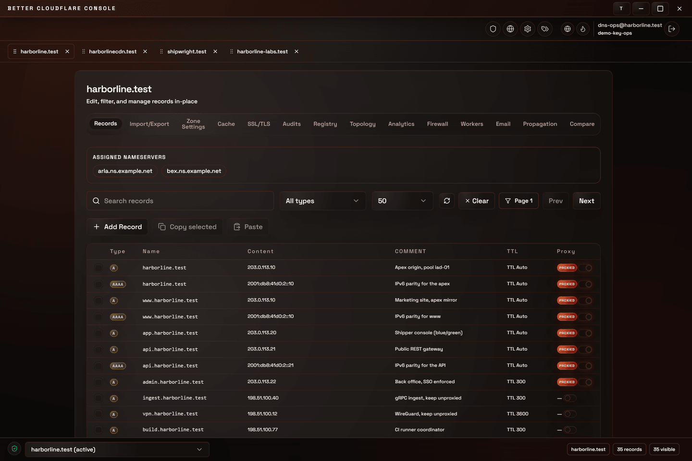
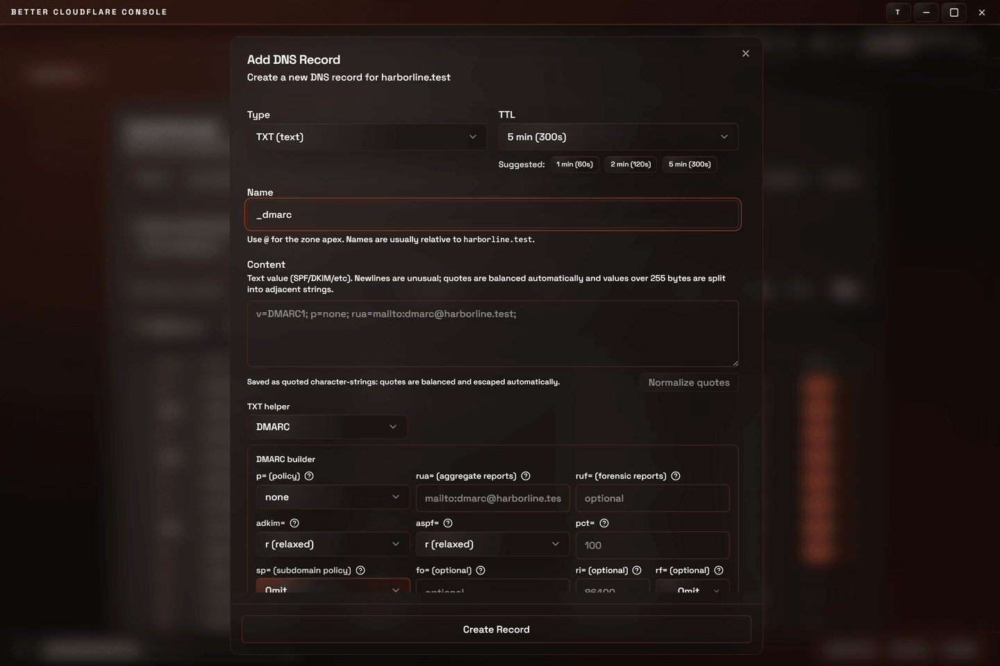
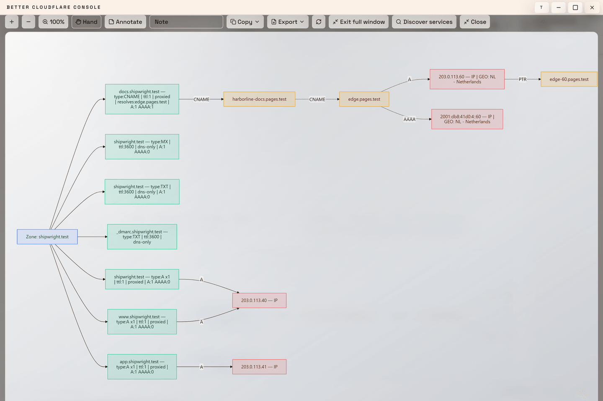

# Better Cloudflare

[](https://github.com/supermarsx/better-cloudflare/actions/workflows/ci.yml)
[](https://github.com/supermarsx/better-cloudflare/releases)
[](license.md)
[](https://supermarsx.github.io/better-cloudflare/)

[](https://tauri.app/)
[](https://www.rust-lang.org/)
[](https://nextjs.org/)
[](https://react.dev/)

A desktop app for managing DNS across a lot of Cloudflare zones at once.

It runs on your own machine, keeps your API keys in your operating system's
keyring, and talks to Cloudflare directly — nothing goes through a server of
ours, because there isn't one.

> ### Please read this first
>
> **This is experimental software, and it edits live DNS.**
>
> It is under active development and is not stable. Expect bugs, and expect
> settings and saved data to change shape between releases. Keep your own
> backups, and check what it changed in the Cloudflare dashboard afterwards.
>
> Don't rely on it for DNS you can't afford to break unless you verify its
> work yourself. No warranty — see [license.md](license.md).



## Contents

- [Who it's for](#who-its-for)
- [What you can do](#what-you-can-do)
- [Install it](#install-it)
- [Your credentials](#your-credentials)
- [Known limits](#known-limits)
- [Build it yourself](#build-it-yourself)
- [Documentation](#documentation)
- [Contributing](#contributing)
- [License](#license)

## Who it's for

If you keep DNS for one domain, the Cloudflare dashboard is fine. This is
built for the other situation: many zones, lots of records, and the kind of
edits that are tedious and easy to get wrong by hand.

Three things it tries to make less painful:

- **Bulk work.** Change TTLs, proxy state or tags across a whole selection,
  and import or export in JSON, CSV or BIND with a preview first.
- **The fiddly record types.** SPF, DMARC, CAA, TLSA, SVCB and friends get
  guided forms with labelled fields, instead of one long string you have to
  assemble correctly from memory.
- **Moving records between zones.** Copy and paste across zones and the
  hostnames inside the records are rewritten for the destination, with a
  preview of everything that changed.

Rather than typing a DMARC policy out as one string, you fill in the parts:



And when you want to know what a hostname actually resolves to, the topology
view follows the chain for you:



Each zone opens in its own tab, and each tab has fourteen views — records,
import/export, zone settings, cache, SSL/TLS, audits, registry, topology,
analytics, firewall, workers, email routing, propagation and zone comparison.

## What you can do

Everything below is in the app today. If something isn't listed, it isn't
built — and [Known limits](#known-limits) covers the gaps worth knowing about.

| Area               | What you get                                                                                                                                                                                                                                  |
| ------------------ | --------------------------------------------------------------------------------------------------------------------------------------------------------------------------------------------------------------------------------------------- |
| **Records**        | Guided forms for 25 record types, each field checked as you type · edit in place in the table · choose your columns · right-click actions · colour-coded tags · bulk TTL, proxy, delete and export                                            |
| **Moving records** | Copy records between zones with hostnames rewritten for the destination, including inside SPF and DMARC · see every change before it's written · or copy verbatim if you'd rather                                                             |
| **Import/export**  | JSON, CSV and BIND both ways, with a dry run first · an exportable log of what the app has done                                                                                                                                               |
| **Zones**          | A tab per zone, reorderable by mouse or keyboard · compare two zones and copy what's missing in one click                                                                                                                                     |
| **Checks**         | A health audit covering email, security and hygiene, with findings you can dismiss individually · follow CNAME chains on a diagram · expand and simulate SPF · check propagation against 23+ resolvers                                        |
| **Domains**        | Renewal dates, locks and auto-renew across Cloudflare, Porkbun, Namecheap, GoDaddy, Google Cloud Domains and Name.com · registry lookups for who a domain is with and when it expires                                                         |
| **Monitoring**     | Optional background watch for approaching renewals, records changed outside the app, and failed health checks · an inbox you can read, archive and dismiss · intervals, quiet hours and per-zone rules all configurable                       |
| **AI assistant**   | Bring your own provider — anything OpenAI-compatible, plus Anthropic and Ollama · it can use the app's tools, and you decide which, one by one · as a tab, a side panel or a floating bubble you can drag anywhere · keeps your conversations |
| **Automation**     | An optional local server so other tools on your machine can drive the app · off until you turn it on, and reaches only what you grant                                                                                                         |
| **Security**       | API keys encrypted on disk, secrets in your OS keyring · sign in with a passkey, or unlock quickly with Touch ID or Windows Hello                                                                                                             |

Your assistant's provider key never reaches the part of the app that draws the
screen: every request to a model is made by the backend. A test fails the
build if a provider address appears in the interface code at all.

Every screen is walked through in
[Screens and features](https://supermarsx.github.io/better-cloudflare/screens.html).

## Install it

Download from the [releases page](https://github.com/supermarsx/better-cloudflare/releases).
Builds are published for both Intel/AMD (x64) and ARM (arm64).

| Your system | Download                                   |
| ----------- | ------------------------------------------ |
| Windows     | `-setup.exe`, `.msi`, or a portable `.exe` |
| macOS       | `.dmg`                                     |
| Linux       | `.AppImage`, `.deb`, `.rpm`, `.flatpak`    |

A few things worth knowing before you pick one:

- **Windows:** the two installers can set up the Edge WebView2 runtime if it's
  missing. The portable `.exe` can't, so it needs WebView2 already present —
  it is, on an up-to-date Windows 10 or 11. If it's missing, the app tells you
  and links to it rather than just failing.
- **Linux:** the `.deb`, `.rpm` and Flatpak builds use the WebKitGTK already
  on your system, so they're much smaller, and your package manager will pull
  in what they need. The AppImage is bigger but needs nothing installed.

Every download has its version in the filename, plus a `.sha256` file and a
build attestation if you want to verify it came from this repository —
[how to check](.github/RELEASE_SECURITY.md).

> If you have a script that downloads a fixed filename from
> `/releases/latest/download/`, it needs updating: filenames now include the
> release version, so ask the GitHub releases API for the asset list instead.

There is no Homebrew, Chocolatey, WinGet, Flathub or Snap package, the
downloads aren't code-signed or notarized, and the app does not update itself.

## Your credentials

Your Cloudflare API keys are encrypted before they're stored, using a key
derived from your password. Secrets live in your operating system's keyring —
Keychain on macOS, Credential Manager on Windows, the Secret Service on Linux
— and never anywhere less protected. If the keyring isn't available, saving
fails and says so, rather than quietly putting your keys somewhere weaker.

You can sign in with a passkey, and unlock quickly with Touch ID or Windows
Hello. How long unlocking takes is yours to tune, with a benchmark button so
you can pick a setting rather than guess.

The full picture — exactly what's encrypted and how, what each platform
guarantees, and where the current limits are — is in the
[security model](https://supermarsx.github.io/better-cloudflare/security.html).

## Known limits

- **The app doesn't update itself**, and the downloads aren't signed or
  notarized. You'll see the usual warnings from Windows and macOS about
  software from an unidentified developer.
- **Linux fingerprint unlock is untested.** The code builds, but it has never
  been run on real hardware. Touch ID and Windows Hello are tested.
- **Touch ID and Windows Hello don't protect the same way.** On macOS the
  stored secret is tied to your fingerprint or face. On Windows the prompt
  gates access inside the app and the secret is protected by your Windows
  sign-in.
- **The AI assistant is desktop-only.** It also needs you to grant it tools
  before it can do anything — with none granted it will talk, but act on
  nothing.
- **Passkeys registered before the login rewrite no longer work.** The old
  implementation didn't verify enough to be safe, so it was replaced rather
  than shipped. Those credentials can still be listed and deleted; register
  again to use a passkey.

## Build it yourself

You'll need Node.js (`^20.19 || ^22.13 || >=24`), a Rust toolchain, and the
[Tauri v2 prerequisites](https://tauri.app/start/prerequisites/) for your
platform.

```bash
git clone https://github.com/supermarsx/better-cloudflare.git
cd better-cloudflare
npm ci
npm run tauri:dev      # run it in a dev window
npm run tauri:build    # build an installable bundle
```

Commands, the test setup and how CI is gated are covered in the
[development guide](https://supermarsx.github.io/better-cloudflare/development.html).

## Documentation

The guides are published at
**[supermarsx.github.io/better-cloudflare](https://supermarsx.github.io/better-cloudflare/)**,
searchable and with every screenshot rendered. The same pages live in
[`docs/`](docs/) if you'd rather read them here.

- [Screens and features](https://supermarsx.github.io/better-cloudflare/screens.html) — every screen, and what it's for
- [Security model](https://supermarsx.github.io/better-cloudflare/security.html) — encryption, storage, passkeys, and current limits
- [Architecture](https://supermarsx.github.io/better-cloudflare/architecture.html) — how the app is put together
- [Development](https://supermarsx.github.io/better-cloudflare/development.html) — commands, tests, CI
- [Design system](https://supermarsx.github.io/better-cloudflare/design-system.html) — theming and UI conventions
- [SPF and NAPTR notes](https://supermarsx.github.io/better-cloudflare/spf-naptr.html)

## Contributing

Work on a branch, run `npm run check`, and update the docs or tests alongside
whatever you change.

## License

MIT — see [license.md](license.md).
